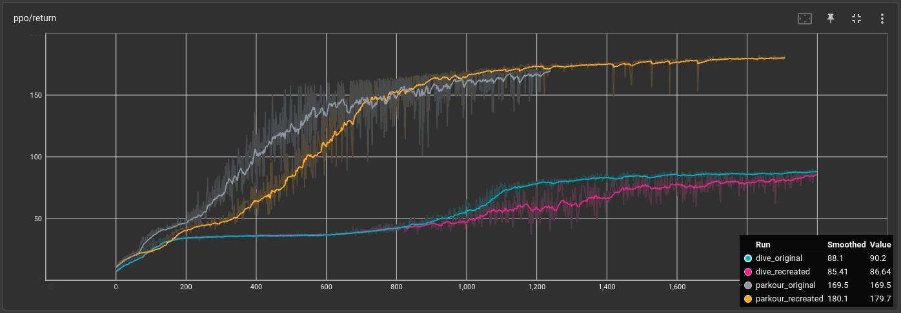

# OGMP: Oracle Guided Multimodal Policies for Agile and Versatile Robot Control

Codebase accompanying the paper [OGMP: Oracle Guided Multimodal Policies for Agile and Versatile Robot Control](https://arxiv.org/abs/2403.04205). For support please raise an issue here or contact the authors.

<p align="center">
   
   
</p>

## Installation

Make a virtual environment,

    python3 -m venv ogmp_env
    source ogmp_env/bin/activate

Clone the repo,

    git clone --depth 1 https://github.com/DRCL-USC/ogmp

To install the dependencies, run:
    
    pip3 install -r requirements.txt

Install old version of torch (new may work but is not tested)
    
    pip3 install torch==1.13.0+cpu --extra-index-url https://download.pytorch.org/whl/cpu

tested in python 3.8.10

## Usage

To test the policy in paper,for task (say parkour), run
    
    python3 test.py --tstng_conf_path ./exp_confs/parkour_test.yaml --render_onscreen

Similarly to train the best policy from the paper, run 

    python3 train.py --exp_conf_path ./exp_confs/parkour.yaml --recurrent --logdir ./logs/

## High-level overview

* algos: contains the custom ppo implementation from [link](https://github.com/osudrl/RSS-2020-learning-memory-based-control)
* analysis: contains the code for analysis presenteed in the paper
* nn: contains the custom torch neural network (FF and LSTM), policy, critic implementation from [link](https://github.com/osudrl/RSS-2020-learning-memory-based-control)
* logs: contains the training logs, policies and encoders.
* dtsd: contains the environments
* exp_confs: contains the experiment configuration files for training and testing.
* train.py: file to train policies.
* test.py: file to test policies.

## Recreating results from the paper


Since the paper, the codebase has been cleaned and made modular for easy usage. This results in minor change in the training convergence (as show in the figure right ), but qualitatively the policy's performance remain indistinguishable. 

<br clear="left"/>

## Citation

If you find this code useful, consider citing:

```
    @misc{krishna2024ogmp,
      title={OGMP: Oracle Guided Multimodal Policies for Agile and Versatile Robot Control}, 
      author={Lokesh Krishna and Nikhil Sobanbabu and Quan Nguyen},
      year={2024},
      eprint={2403.04205},
      archivePrefix={arXiv},
      primaryClass={cs.RO}
    }
```
